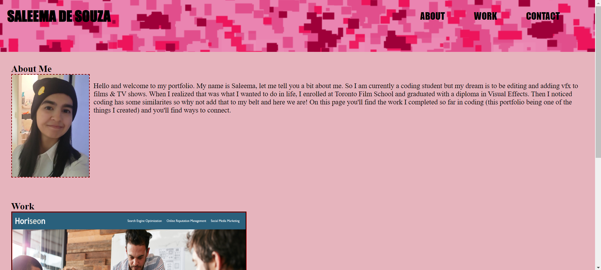

# Challenge-Two: 
## Creating a web application-Portfolio Page

## Description

This is code used (HTML & CSS) to create my online portfolio to showcase my work, skills, and myself to future employers.

## Links

Check it out through GitHUb (under SaleemaDe/Challenge-Two): https://github.com/SaleemaDe

View Portfolio: http://127.0.0.1:5500/index.html

 

-------------------------------------------------------------------------
### Breakdown Of Acceptance Criteria

> Show previous work in protfolio and through an img that can be selected then directed to the GitHub repo. 

> Have links in navigation working along with ways to contact

> Image of myself

> Screen is able to resize/adjust accordingly to any device

